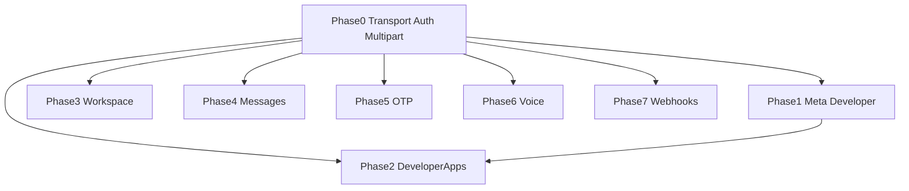

# Briq Python SDK — API alignment plan (from OpenAPI)

This document is the implementation guide for bringing the Python SDK in line with [openapi.json](../openapi.json) (Briq API **0.8**). Work is organized **one phase per API category** (OpenAPI tag), plus **Phase 0** for shared HTTP/auth behavior. Use it to execute **one phase at a time** with clear completion checks.

---

## Baseline snapshot

| Area | OpenAPI ([openapi.json](../openapi.json)) | Current SDK |
|------|--------------------------------------------|-------------|
| HTTP routing | Paths under `/`, `/karibu/...`, `/developer-apps/...`, `/v1/...` | [`Client.request`](../briq/client.py) builds `{base_url}/v1/{endpoint}` only |
| Auth | `X-API-Key` on most `/v1/*`; **Developer Apps** use `OAuth2PasswordBearer` (`tokenUrl: /auth/login`) | API key only; no bearer token / login flow |
| Workspace | `WorkspaceCreate` / `WorkspaceUpdate` include `developer_access` | [`WorkspaceAPI`](../briq/workspace/__init__.py) omits `developer_access` |
| Messages | 6 operations; instant send supports optional `groups`, `flash`, `send_at`; header `X-App-ID` | 4 methods; missing recipient history + message detail GETs; no new body/header fields |
| OTP / Voice / Webhooks | Full tag groups | **Not implemented** |
| Developer / meta | `GET /`, `GET /version`, `GET /karibu/x-api-key` | Not exposed |

**Tests:** [`tests/test_client.py`](../tests/test_client.py) mocks `request("GET", "test/endpoint")` but has asserted URLs that do not match [`client.py`](../briq/client.py) behavior; align tests when refactoring transport.

*Karibu-Campaign / [`CampaignAPI`](../briq/campaign/__init__.py) is not covered by a phase in this document (out of scope here).*

---

## Phase 0 — Cross-cutting: HTTP transport, URL prefixes, and auth modes (prerequisite)

**Why first:** Without routing non-`/v1` paths and optional Bearer auth, **Developer Apps** (Phase 2) and correct **meta** endpoints (Phase 1) cannot be implemented faithfully.

### Scope

- Resolve URL construction: support at least — (a) paths under the host root (e.g. `version`, `karibu/x-api-key`), (b) **`/v1/`** prefix for Karibu-* tags (current behavior), (c) **`/developer-apps/`** (and related) **without** inserting `/v1`.
- Add **OAuth2 password flow** client surface: configurable `token_url` (default `/auth/login` relative to `base_url`), store `access_token`, send `Authorization: Bearer ...` when calling secured routes; document a simple strategy (e.g. login once per session).
- **`multipart/form-data`** path for voice upload (`POST /v1/voice/calls/audio/upload`) — do not send JSON `Content-Type` for that call.
- Error handling: map **422** validation (`HTTPValidationError`) to a dedicated exception or structured error payload (today only 400/401 paths are partially handled).

### Completion criteria

- A single internal helper builds the final URL per operation category without double slashes or wrong `/v1` insertion.
- Integration-style unit tests (mocked HTTP) prove: `/version` hits `{base}/version`, workspace still hits `{base}/v1/workspace/...`, developer-apps hits `{base}/developer-apps/...`.
- Bearer token is used for operations that declare `security: OAuth2PasswordBearer`; `X-API-Key` remains the default for `/v1/*` Karibu endpoints per spec.

### Steps (suggested)

1. Introduce URL builder + `path_prefix` (or equivalent) on the client.
2. Add `login` / `config.access_token` and Bearer headers for developer-app routes.
3. Add multipart request path for file upload.
4. Add `BriqValidationError` (or similar) and parse 422 `detail` when present.
5. Update and add unit tests for URL and auth behavior.

### Reliability / risks

- Prefer explicit path templates in each module over ad hoc string joins.
- **Breaking change:** any code that depended on the old “everything under `/v1`” behavior will need to use the new path mode for meta and developer apps.
- Record [openapi.json](../openapi.json) `info.version` (0.8) in the package changelog / `__version__` when you release aligned SDK changes.

---

## Phase 1 — Tags: *(untagged)* **Meta** + **Developer**

OpenAPI operations: `GET /`, `GET /version`, `GET /karibu/x-api-key` (tag **Developer**).

### Scope

- Thin `MetaAPI` (or methods on `Client`): `hello()` (or equivalent), `get_version()`, `developer_stats()` (validate API key / developer info).
- **Developer** route uses **`X-API-Key`**; meta routes have no `/v1` prefix.

### Completion criteria

- All three operations are callable; return type documented as `dict` (some response schemas in OpenAPI are empty `{}` — optional follow-up: typed models).
- Tests assert final URLs per Phase 0 rules.

### Steps

1. Implement GET `/`, `/version`, `/karibu/x-api-key` using `path_prefix=absolute` (or your Phase 0 equivalent).
2. Use `auth=none` or `X-API-Key` as per each operation in OpenAPI.
3. Add unit tests with mocked `requests`.

### Reliability

- Idempotent GETs; suitable for health checks.

---

## Phase 2 — Tag: **Developer Apps**

Eleven operations under `/developer-apps/...` and `/workspaces/{workspace_id}/developer-apps`; **OAuth2** security on these routes per spec.

### Scope

- New `DeveloperAppsAPI` (or equivalent): list/create/get/patch/delete app, get by key, list by workspace, transfer, attach API key, stats, list API keys for app.
- Depends on Phase 0 **Bearer** auth and **non-v1** base paths.
- Request/response shapes aligned with OpenAPI components (`DeveloperAppCreate`, `DeveloperAppResponse`, `APIKeyOut`, etc.).

### Completion criteria

- Each OpenAPI operation has a corresponding SDK method with parameters matching path, query, and body.
- Automated tests with mocked bearer token and mocked HTTP for each verb (where practical).

### Steps

1. Map each path to a method; use Bearer auth.
2. Handle `201` on create, `204` on delete, empty JSON where applicable.
3. Document that users must `login()` or set `access_token` before calling these methods.

### Reliability

- OAuth token lifecycle is explicit: document that a login or manual token is required.
- Mutations (DELETE, transfer, attach) may return 204 or empty body — `request()` must not assume JSON for every success.

---

## Phase 3 — Tag: **Karibu-Workspace**

Paths: `/v1/workspace/create/`, `all/`, `{workspace_id}`, `update/{workspace_id}`.

### Scope

- Extend `WorkspaceAPI.create` / `update` with **`developer_access`** per `WorkspaceCreate` / `WorkspaceUpdate`.
- Where OpenAPI allows `null` in PATCH, support clearing fields if the API expects explicit nulls.

### Completion criteria

- `create` / `update` accept optional `developer_access`; tests updated.
- No regression on existing workspace tests.

### Steps

1. Add `developer_access` to payload builders with default **false** on create (per spec).
2. Extend `update` to pass through `developer_access` when provided.

### Reliability

- Backward compatible if new parameters are optional with spec-aligned defaults.

---

## Phase 4 — Tag: **Karibu-Messages**

### Scope

- Add **`get_history_by_recipient(recipient)`** → `GET /v1/message/history/recipient/{recipient}`.
- Add **`get_message_log(message_id)`** → `GET /v1/message/message-log/{message_id}`.
- Extend **`send_instant`**: optional `groups`, `flash`, `send_at`; optional header **`X-App-ID`**.
- Extend **`send_campaign`**: optional **`X-App-ID`**.
- Optional: `TypedDict` / dataclasses for `SendInstantMessageResponse` (`job_id`, `stats`, `meta`).

### Completion criteria

- All six operations in the Karibu-Messages tag are implemented.
- Tests for new GETs and for optional instant-send fields and headers.

### Steps

1. Add two GET helpers for history-by-recipient and message detail.
2. Extend `send_instant` / `send_campaign` with optional body and header parameters.
3. Document `send_at` as ISO 8601 with UTC as in the OpenAPI description.

### Reliability

- `send_at` scheduling: document timezone requirements clearly for integrators.

---

## Phase 5 — Tag: **Karibu-OTP**

### Scope

- New `OtpAPI`: `request`, `verify`, `resend`, `invalidate`, `status` mapping to `/v1/otp/*` and the request/query schemas in components.

### Completion criteria

- All five operations implemented; tests with mocked responses.

### Steps

1. Implement POST bodies per `OTP*DeveloperAppSchema` and GET `status` with required query params.
2. Add unit tests.

### Reliability

- Do not log OTP values in application logs; rate limits are server-defined (not in the spec).

---

## Phase 6 — Tag: **Karibu-Voice**

### Scope

- `POST /v1/voice/calls/audio` — JSON: `VoiceCallAudioRequest`.
- `POST /v1/voice/calls/audio/upload` — **multipart** file + `receiver_number` (Phase 0).
- `POST /v1/voice/calls/tts` — JSON: `VoiceCallTtsRequest`.

### Completion criteria

- Three methods; upload uses multipart (`files=`) not a JSON body.

### Steps

1. Add `VoiceAPI` (or similar) with three methods.
2. Reuse Phase 0 multipart support.

### Reliability

- Large uploads may need streaming later; document file size limits if the API provides them.

---

## Phase 7 — Tag: **Karibu-Webhooks**

### Scope

- New `WebhooksAPI`: create, list all, list by app, get by id, patch, delete (`WebhookCreate`, `WebhookUpdate`, `WebhookOut`).
- Handle **204** on delete.

### Completion criteria

- Six operations match OpenAPI; PATCH uses `WebhookUpdate` fields (`service_type` pattern, `url`, `secret_token`).

### Steps

1. Implement CRUD + list patterns per paths under `/v1/webhooks/...`.
2. Ensure delete success with no body returns a sensible value (e.g. `{}`).

### Reliability

- `secret_token` in responses may be masked; document that integrators should not assume the full token is returned.

---

## Dependency flow (implementation order)

Complete **Phase 0** before Phases 1–7. **Phase 1** before **Phase 2** is recommended (meta + key check before heavy developer-app work).

---

## Global reliability checklist (all phases)

- **Contract source of truth:** Re-import or diff `openapi.json` when the server version changes; repeat a small gap review.
- **Testing:** Unit tests with mocked `requests`; optional integration tests against pre-release with secrets in CI.
- **Backward compatibility:** Prefer optional new parameters and deprecation windows; document breaking changes in a CHANGELOG.
- **Package version:** Align `briq.__version__` with release notes after API alignment.

---

## How to use this document

- Pick **one phase**, implement it end-to-end, then check **Completion criteria** before moving on.
- If a phase depends on **Phase 0** (all phases do), ensure transport/auth is in place first.
- Keep this file updated if the server OpenAPI or your internal decisions change (e.g. login URL or form format).
